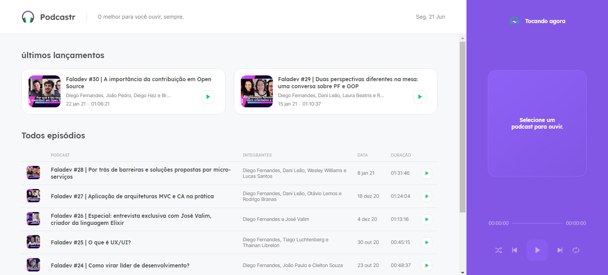
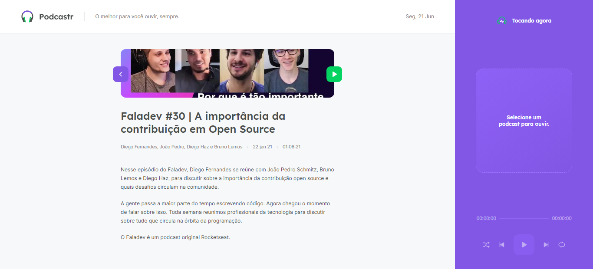
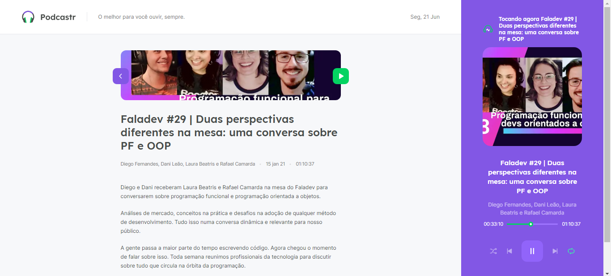

<h1 align="center">
  
</h1>

 

## 🚀 | Technologies

This project was developed with the following technologies:

- [React](https://reactjs.org)
- [Next.js](https://nextjs.org/)
- [TypeScript](https://www.typescriptlang.org/)

## 💻 | Project

Developed during an `Rocketseat` event, the Podcastr is an app for playing audio episodes of your favorite podcast. 
Initially I did exactly rocketseat's proposal, but I'm already finishing another proposal based on another podcast that I like a lot.
I already knew about next.js, but this project gave me another perspective, and I loved it. I will definitely adopt this lib more.

 

## 🔖 | Layout

Look this images, it's amazing design!

  
  
  

